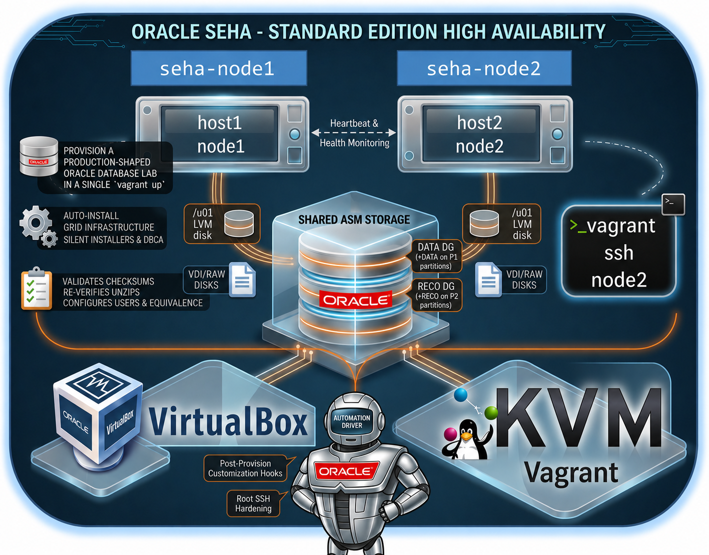

# Oracle SEHA Lab
## Oracle Database 19c (19.3.0) on Oracle Linux 7

This directory provisions an Oracle Standard Edition High Availability (SEHA)
lab from a single `vagrant up`.



The build is intentionally SEHA-only:

- two Oracle Linux 7 VMs: `host1` and `host2`
- two-node Grid Infrastructure cluster with SCAN, VIPs, private interconnect, and ASM
- required OPatch `p6880880_190000_Linux-x86-64.zip` installed into each home
  before applying the RU
- separate 19c Release Updates 19.7 or newer applied to the GI and DB homes
  before install
- RDBMS software install across both nodes using the edition supported by the
  Oracle 19c DB home ZIP
- shared ASM storage with `+DATA` and `+RECO`


> This is a lab build, not a hardened production blueprint. The defaults include
> demo passwords, `firewalld` disabled, `/etc/hosts`-driven name resolution, and
> silent installers invoked with `-ignorePrereq`.

## At a Glance

| Area | Value |
| --- | --- |
| Virtualization | VirtualBox or KVM/libvirt |
| Operating system | `oraclelinux/7` |
| GI / DB version | 19.3.0.0 |
| Database edition | Requires `SE2` |
| Nodes | `host1`, `host2` |
| ASM diskgroups | `DATA` on P1 partitions, `RECO` on P2 partitions |
| Runtime env file | `/etc/opt/oracle-seha/setup.env` |
| Hook model | `userscripts/*.sh` as `root`, `userscripts/*.sql` as `SYSDBA` |

## Quick Start

1. Create your local config:

   ```bash
   cd SEHA
   cp config/vagrant.yml.example config/vagrant.yml
   ```

2. Place the Oracle 19c installer zips, required OPatch zip, a 19.7-or-newer
   Grid Infrastructure RU zip, under
   `ORCL_software/`:

   ```text
   ORCL_software/LINUX.X64_193000_grid_home.zip
   ORCL_software/LINUX.X64_193000_db_home.zip
   ORCL_software/p6880880_190000_Linux-x86-64.zip
   ORCL_software/p39036936_190000_Linux-x86-64.zip
   ```

3. Confirm `db_installer.cksum` matches the installers:

   ```bash
   cksum ORCL_software/LINUX.X64_193000_grid_home.zip
   cksum ORCL_software/LINUX.X64_193000_db_home.zip
   cksum ORCL_software/p6880880_190000_Linux-x86-64.zip
   cksum ORCL_software/p39036936_190000_Linux-x86-64.zip
   ```

   RU patching is part of the clean provisioning flow. The required OPatch is
   installed into each extracted GI and DB home, then the matching GI or DB RU is
   applied before the installers run; it does not patch an already-created
   database.

4. Launch the lab:

   ```bash
   vagrant up
   ```

5. Connect to the guests:

   ```bash
   vagrant ssh host1
   vagrant ssh host2
   ```

## Configuration

All runtime settings live in `config/vagrant.yml`.

| Key | Default | Notes |
| --- | --- | --- |
| `env.provider` | `virtualbox` | Must be `virtualbox` or `libvirt` |
| `env.prefix_name` | `seha19-ol7` | Drives VM, cluster, ASM disk, and SCAN names |
| `env.domain` | `localdomain` | Used for host, VIP, private, and SCAN names |
| `host1.vm_name` | `node1` | Primary orchestration node |
| `host2.vm_name` | `node2` | Secondary node and initial shared-disk partition owner |
| `env.asm_disk_num` | `4` | Minimum 4 shared ASM disks |
| `env.asm_disk_size` | `20` | GB per shared ASM disk |
| `env.p1_ratio` | `80` | Percentage assigned to DATA partitions |
| `env.opatch_software` | `p6880880_190000_Linux-x86-64.zip` | Required 19c OPatch zip under `ORCL_software/` |
| `env.gi_ru_software` | `p39036936_190000_Linux-x86-64.zip` | Required 19c Grid Infrastructure RU zip, 19.7 or newer, under `ORCL_software/` |
| `env.ru_software` | `p39034528_190000_Linux-x86-64.zip` | Required 19c Database RU zip, 19.7 or newer, under `ORCL_software/` |
| `env.db_name` | `SEHA19` | Global database name and SID |
| `env.cdb` | `true` | Requires `pdb_name` and `pdb_password` when true |
| `env.db_recovery_file_dest_size` | `4G` | Passed to DBCA |


## Password Overrides

The YAML password values are demo placeholders. You can override them at run
time:

```bash
export ORACLE_SEHA_ROOT_PASSWORD='strong-root-password'
export ORACLE_SEHA_GRID_PASSWORD='strong-grid-password'
export ORACLE_SEHA_ORACLE_PASSWORD='strong-oracle-password'
export ORACLE_SEHA_SYS_PASSWORD='strong-sys-password'
export ORACLE_SEHA_PDB_PASSWORD='strong-pdb-password'
vagrant up
```

## Provisioning Pipeline

The orchestration entrypoint is `scripts/setup.sh`. It writes
`/etc/opt/oracle-seha/setup.env`, sources `scripts/_common.sh`, and runs these
numbered stages:

| Step | Script | Purpose |
| --- | --- | --- |
| 01 | `scripts/01_install_os_packages.sh` | Installs OS and GI prerequisites |
| 02 | `scripts/02_setup_u01.sh` | Creates GPT, LVM, XFS, and `/u01` |
| 03 | `scripts/03_setup_hosts.sh` | Rewrites host resolution and SCAN dnsmasq records |
| 04 | `scripts/04_setup_chrony.sh` | Disables time daemons so CTSS runs active |
| 05 | `scripts/05_setup_users.sh` | Creates users, groups, homes, limits, and profiles |
| 06 | `scripts/06_setup_shared_disks.sh` | Partitions shared disks and creates ASM udev names |
| 07 | `scripts/07_extract_gi.sh` | Verifies, extracts, and RU-patches the Grid home |
| 08 | `scripts/08_setup_user_equ.sh` | Builds SSH equivalence for `grid`, `oracle`, and `root` |
| 10 | `scripts/10_gi_installation.sh` | Runs `gridSetup.sh` for CRS software/config staging |
| 11 | `scripts/11_gi_root.sh` | Runs GI root scripts locally and on node2 |
| 12 | `scripts/12_gi_config.sh` | Runs `gridSetup.sh -executeConfigTools` |
| 13 | `scripts/13_make_reco_dg.sh` | Ensures `DATA` and `RECO` are mounted on both nodes |
| 14 | `scripts/14_extract_db.sh` | Verifies, extracts, and RU-patches the RDBMS home |
| 15 | `scripts/15_db_software_installation.sh` | Installs DB software across both nodes |
| 16 | `scripts/16_create_database.sh` | Creates the SEHA database |
| 17 | `scripts/17_check_database.sh` | Validates Clusterware registration with `srvctl` |

## Validation

After `vagrant up`, useful in-guest checks are:

```bash
vagrant ssh host1

sudo cat /etc/opt/oracle-seha/setup.env
sudo su - grid
asmcmd lsdg

sudo su - oracle
srvctl config database -d SEHA26
srvctl status database -d SEHA26
```

Repeat the `srvctl` checks from `host2` to confirm both nodes see the same
Clusterware-managed database resource.

## Cleanup

Destroy the VMs and remove lab-owned ASM and `/u01` disks:

```bash
cleanup/cleanup.sh --force
```
